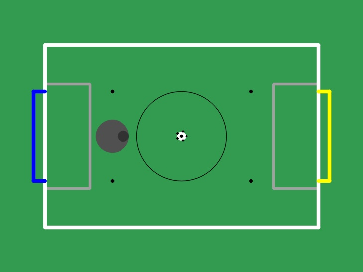
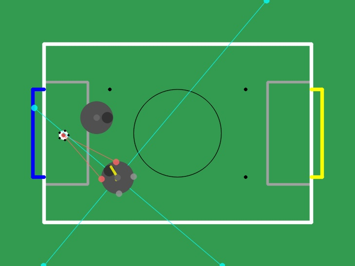

# 🤖⚽ RoboCup Junior Simulator

> A custom-built 2D physics simulation environment created specifically for my team's entry into the RoboCup Junior soccer competition!



## 🎯 Overview

This project is a **Gym-compatible simulation environment** that I built from scratch to help my team develop, test, and train AI-powered robots for our RoboCup Junior Soccer competition entry. Using custom 2D physics and collision detection, it provides a realistic testing ground for robot algorithms before deploying to physical hardware.

### ✨ Key Features

- 🎮 **OpenAI Gym Interface** - Standard RL environment API for easy integration with RL libraries
- 🧠 **Reinforcement Learning Ready** - Train agents using PPO, A2C, DQN, and more via Stable Baselines3
- ⚙️ **Custom 2D Physics Engine** - Handcrafted collision detection and physics simulation
- 🤖 **Realistic Robot Modeling** - 4 sensor types matching real-world RoboCup robots
- 🎨 **Real-time Visualization** - PyGame + OpenCV rendering with sensor overlays
- 👤 **Human Playable** - Manual control mode for testing strategies
- 🏟️ **Accurate Arena** - Official RoboCup Junior Soccer field dimensions and rules

## 🏗️ Architecture

```
┌─────────────────────────────────────────────────────────────────┐
│                     RoboCupEnv (Gym Environment)                │
├─────────────────────────────────────────────────────────────────┤
│  ┌──────────┐  ┌──────────┐  ┌──────────┐  ┌──────────┐        │
│  │  Robot   │  │   Ball   │  │  Arena   │  │  Field   │        │
│  │  (Agent) │  │ (Object) │  │ (World)  │  │ (Bounds) │        │
│  └────┬─────┘  └────┬─────┘  └────┬─────┘  └────┬─────┘        │
│       │             │             │             │               │
│  ┌────▼─────────────▼─────────────▼─────────────▼────┐         │
│  │              Custom 2D Physics Engine             │         │
│  │         (Collision Detection & Response)          │         │
│  └───────────────────────────────────────────────────┘         │
└─────────────────────────────────────────────────────────────────┘
```

## 🤖 Robot Specifications

The simulated robot is modeled after a real RoboCup Junior soccer robot with **omnidirectional movement** capabilities and a comprehensive sensor suite.

### 🎮 Actions (4-Dimensional Continuous Space)

| Action | Description                       | Range  | Unit                   |
| ------ | --------------------------------- | ------ | ---------------------- |
| `dx`   | X-component of movement direction | [0, 1] | normalized             |
| `dy`   | Y-component of movement direction | [0, 1] | normalized             |
| `v1`   | Movement velocity multiplier      | [0, 1] | × max_velocity         |
| `a1`   | Angular velocity                  | [0, 1] | × max_angular_velocity |

**Action Space:** `Box(low=0.0, high=1.0, shape=(4,), dtype=np.float32)`

> **Note:** The robot moves omnidirectionally - rotation is independent of movement direction!

### 📡 Sensors (12-Dimensional Observation Space)

| Sensor           | Count | Description                         | Output     |
| ---------------- | ----- | ----------------------------------- | ---------- |
| **🧭 Compass**    | 3     | Detects robot's facing direction    | [0, 1] × 3 |
| **🔴 Infrared**   | 4     | Detects ball's relative position    | [0, 1] × 4 |
| **📏 Ultrasonic** | 4     | Measures distance to walls/objects  | [0, 1] × 4 |
| **⚪ Line**       | 1     | Detects if over white boundary line | [0, 1]     |

**Observation Space:** `Box(low=0.0, high=1.0, shape=(12,), dtype=np.float32)`

```python
observation = [
    c1, c2, c3,     # Compass sensors (3)
    i1, i2, i3, i4, # Infrared sensors (4)
    u1, u2, u3, u4, # Ultrasonic sensors (4)
    l1              # Line sensor (1)
]  # Total: 12 values
```

## 🏟️ Arena & Game Rules

The arena follows official RoboCup Junior Soccer specifications with a **2.43m × 1.82m** field.



### 🎯 Scoring & Rewards

| Event                 | Reward | Done    | Description                 |
| --------------------- | ------ | ------- | --------------------------- |
| ⚽ Ball in Yellow Goal | **+1** | ✅ True  | Own team scores!            |
| ⚽ Ball in Blue Goal   | **-1** | ✅ True  | Opponent scores             |
| 🚫 Robot Out of Bounds | **-1** | ❌ False | Penalty, continue playing   |
| ⏱️ Max Steps Reached   | 0      | ✅ True  | Episode timeout (400 steps) |

### 🎁 Shaped Rewards

The environment includes additional reward shaping to guide learning:
- **Proximity to ball** - Reward for getting closer to the ball
- **Proximity to opponent goal** - Reward for advancing toward scoring

## 🚀 Installation

### Prerequisites

- Python 3.7+
- pip package manager

### Setup

```bash
# Clone the repository
git clone https://github.com/RonikKapadia/robocup-sim.git
cd RoboCupJuniorSimulator

# Install dependencies
pip install -r requirements.txt
```

### Dependencies

| Package             | Version | Purpose                     |
| ------------------- | ------- | --------------------------- |
| `gymnasium`         | latest  | RL environment interface    |
| `stable-baselines3` | latest  | PPO and other RL algorithms |
| `pygame`            | 2.0+    | Rendering and visualization |
| `opencv-python`     | latest  | Image processing            |
| `numpy`             | latest  | Numerical computations      |
| `tqdm`              | latest  | Progress bars               |

## 🎮 Usage

### 👤 Human Mode (Manual Control)

Test the environment and practice your skills!

```bash
python main_human.py
```

**Controls:**

| Key   | Action                   |
| ----- | ------------------------ |
| `W`   | Move Up                  |
| `S`   | Move Down                |
| `A`   | Move Left                |
| `D`   | Move Right               |
| `Q`   | Rotate Counter-Clockwise |
| `E`   | Rotate Clockwise         |
| `ESC` | Exit                     |

### 🤖 AI Training Mode

Train a robot using Proximal Policy Optimization (PPO):

```bash
python main_ai.py
```

This will:
1. 🎲 Run a random agent to verify the environment
2. 🧠 Train a PPO model for 100,000 timesteps
3. 💾 Save the model to `models/PPO_1`
4. 🎬 Test the trained agent with visualization

### 📝 Custom Training Example

```python
from stable_baselines3 import PPO
from source.ENVIRONMENT import RoboCupEnv

# Create environment
env = RoboCupEnv()

# Initialize model
model = PPO("MlpPolicy", env, verbose=1)

# Train
model.learn(total_timesteps=100_000)

# Save
model.save("models/my_robot")

# Load and test
model = PPO.load("models/my_robot", env)
obs = env.reset()
for _ in range(1000):
    action, _ = model.predict(obs, deterministic=True)
    obs, reward, done, info = env.step(action)
    env.render()
    if done:
        obs = env.reset()
```

## 📁 Project Structure

```
RoboCupJuniorSimulator/
├── 📄 main_human.py          # Manual control script
├── 📄 main_ai.py             # RL training script
├── 📄 requirements.txt       # Python dependencies
├── 📄 README.md              # This file
├── 📁 source/                # Core simulation modules
│   ├── 📄 ENVIRONMENT.py     # Gym environment wrapper
│   ├── 📄 ROBOT.py           # Robot physics & sensors
│   ├── 📄 BALL.py            # Ball physics
│   ├── 📄 ARENA.py           # Arena composition
│   ├── 📄 FIELD.py           # Field boundaries
│   ├── 📄 GOAL.py            # Goal detection
│   ├── 📄 BOUNDARY.py        # Outer boundaries
│   └── 📄 EXTRA.py           # Utility classes
└── 📁 images/                # Screenshots & diagrams
    ├── 🖼️ environment.jpg    # Screenshot
    └── 🖼️ arena.jpg          # Arena layout
```

## 🔬 Technical Details

### Physics Engine

- **Collision Detection:** Separating Axis Theorem (SAT) for circle-line collisions
- **Response:** Elastic collisions with configurable restitution
- **Integration:** Euler method for position updates
- **Time Step:** Fixed Δt = 0.1s (10 FPS physics)

### Sensor Simulation

| Sensor     | Simulation Method                        |
| ---------- | ---------------------------------------- |
| Compass    | 3-way directional sector detection       |
| Infrared   | Ray casting to ball with occlusion check |
| Ultrasonic | Distance to nearest wall/robot           |
| Line       | Box containment test on field boundaries |

### Robot Parameters

```python
mass = 2.2 kg                # Robot mass
size = 0.11 m (11cm)         # Robot radius
max_velocity = 0.5 m/s       # Max linear speed
max_angular_velocity = 1.8 rad/s  # Max rotation speed
elasticity = 0.5             # Bounciness
```

### Ball Parameters

```python
mass = 0.07 kg               # Ball mass (IR ball)
size = 0.0325 m (3.25cm)     # Ball radius
drag = 0.1                   # Linear damping
elasticity = 0.5             # Bounciness
```

## 📝 License

This project was created as a personal project for my team's RoboCup Junior competition entry. Feel free to use and modify for your own team!
